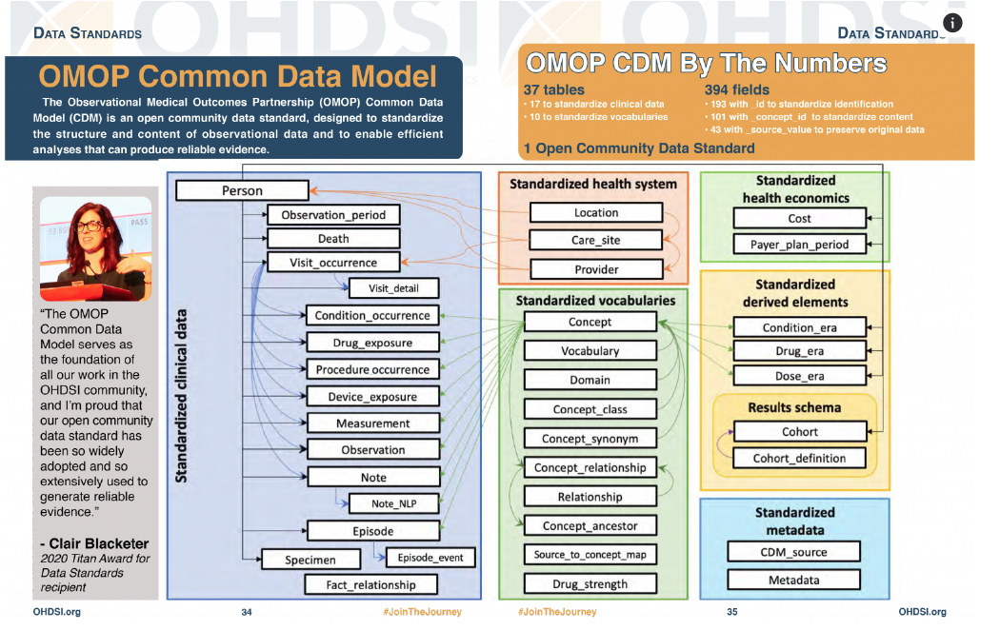

# IHID to OMOP Mapping

This project contains tools to map IHID (Integrated Health Information Database) fields to the OMOP (Observational Medical Outcomes Partnership) Common Data Model structure.

## Overview

The OMOP Common Data Model is a standardized way to organize healthcare data. Although IHID contains de-identified data, it maintains consistent patient identifiers across tables. We map the IHID patient identifiers (patient_id or MRN) to the OMOP person_id as the root identifier, and encounter numbers (encntr_num) to visit_occurrence_id.



The mapping process involves:
1. Analyzing the IHID data structure
2. Mapping IHID fields to corresponding OMOP tables and fields
3. Generating a mapping file for use in ETL processes
4. Validating the mapping for coverage and quality
5. Transforming IHID data to OMOP format

## Tools Included

### 1. IHID-OMOP Mapper (`ihid_omop_mapper.py`)

This script generates a mapping between IHID fields and OMOP fields based on the mapping information provided in the Excel file. 

Key features:
- Table name normalization to handle mismatches between catalog and database (e.g., "Admission - Discharge" vs. "Admission / Discharge")
- Robust handling of missing fields expected in real data but not in the current catalog
- Detailed logging of mapping process and warnings
- Special handling for patient identifiers and encounter numbers

```bash
# Activate virtual environment with pandas and openpyxl
source ~/venv/bin/activate

# Run the mapper
python ihid_omop_mapper.py
```

The script will generate an `ihid_omop_mapping.json` file that can be used by the ETL process.

### 2. Mapping Validator (`mapping_validator.py`)

This tool validates the mapping by checking coverage of both IHID and OMOP fields.
It provides detailed reports on:
- Percentage of mapped IHID tables and fields
- Percentage of mapped OMOP tables and fields
- Lists of unmapped tables and fields
- Top OMOP tables with the most unmapped fields

```bash
# Activate virtual environment with pandas and openpyxl
source ~/venv/bin/activate

# Run the validator
python mapping_validator.py ihid_omop_mapping.json All_Tables_Combined.json OMOP_Summarized_Schema.xlsx
```

### 3. ETL Script (`ihid_etl.py`)

This script uses the mapping to extract, transform, and load data from IHID to OMOP format. It includes:
- Robust handling of missing fields and tables
- Fallback to encounter numbers when patient_id/MRN is not available
- Handling of table name mismatches between catalog and database
- Generation of synthetic data for testing when real data is unavailable
- Linking of person_id and visit_occurrence_id across all relevant tables

```bash
# Run the ETL process
python ihid_etl.py
```

### 4. Sample Database Creation (`create_sample_db.py`)

This script creates a sample SQLite database from the IHID catalog for ETL testing. It:
- Creates tables based on the catalog structure
- Generates realistic sample data with proper relationships
- Handles column type mapping to SQLite types
- Establishes proper relationships between patient_id, MRN, and encounter numbers

```bash
# Create a sample database for testing
python create_sample_db.py
```

## File Details

- `All_Tables_Combined.json`: Contains metadata about the IHID tables and columns
- `OMOP_Summarized_Schema.xlsx`: Contains the OMOP schema with mappings to IHID fields
- `ihid_omop_mapping.json`: Generated mapping file (output of the mapper)
- `ihid_etl.py`: ETL script that uses the mapping to transform data
- `mapping_validator.py`: Validates mapping coverage and quality
- `create_sample_db.py`: Creates a sample SQLite database for ETL testing
- `IHID.db`: Sample SQLite database for testing
- `requirements.txt`: Required Python packages
- `omop_output/`: Directory containing the generated OMOP data files

## OMOP Structure

The OMOP Common Data Model includes tables like:

1. **Person** - Maps to IHID's patient_id or MRN field as the root identifier
2. **Visit_Occurrence** - Maps to IHID admission/discharge records with encntr_num as the visit_occurrence_id
3. **Condition_Occurrence** - Maps to IHID diagnosis records, linked to person_id and visit_occurrence_id
4. **Drug_Exposure** - Maps to IHID medication records, linked to person_id and visit_occurrence_id
5. **Procedure_Occurrence** - Maps to IHID procedure records, linked to person_id and visit_occurrence_id
6. **Measurement** - Maps to IHID lab and other measurement records, linked to person_id and visit_occurrence_id
7. **Observation** - Maps to IHID observation records, linked to person_id and visit_occurrence_id
8. **Death** - Maps to IHID death records, linked to person_id

And other related tables for structured clinical data.

## Complete Pipeline Workflow

1. **Setup Environment**:
   ```bash
   # Install required packages
   pip install -r requirements.txt
   ```

2. **Generate Sample Database** (for testing):
   ```bash
   python create_sample_db.py
   ```

3. **Create Mapping**:
   ```bash
   python ihid_omop_mapper.py
   ```

4. **Validate Mapping**:
   ```bash
   python mapping_validator.py ihid_omop_mapping.json All_Tables_Combined.json OMOP_Summarized_Schema.xlsx
   ```

5. **Run ETL Process**:
   ```bash
   python ihid_etl.py
   ```

6. **Verify Output**:
   Check the generated files in the `omop_output/` directory.

## Robustness Features

### 1. Patient ID Handling
- Primary lookup for `patient_id` field
- Fallback to `MRN` field if patient_id not found
- Fallback to using encounter numbers with `ENC_` prefix if no patient identifiers exist
- Generation of dummy IDs as a last resort

### 2. Table Name Normalization
- Handles different separators (-, /, spaces)
- Matches tables despite case differences
- Sanitizes problematic characters for database compatibility

### 3. Error Handling
- Detailed logging throughout the process
- Warning for missing fields expected in real data
- Graceful handling of database access errors
- Recovery from missing tables or columns

### 4. Testing Support
- Sample database creation for testing without real data
- Synthetic data generation with proper relationships
- Test mode in ETL to validate mappings

## Notes

- The mapping is based on the Excel file `OMOP_Summarized_Schema.xlsx` which contains the correspondence between IHID and OMOP fields.
- Although IHID is de-identified, it maintains consistent patient identifiers (`patient_id` or `MRN`) across tables.
- We use these consistent patient identifiers as the OMOP `person_id` and the encounter numbers (`encntr_num`) as `visit_occurrence_id`.
- Not all IHID fields may have corresponding OMOP fields and vice versa.
- The system is designed to be robust against missing fields, table name variations, and missing patient identifiers.
